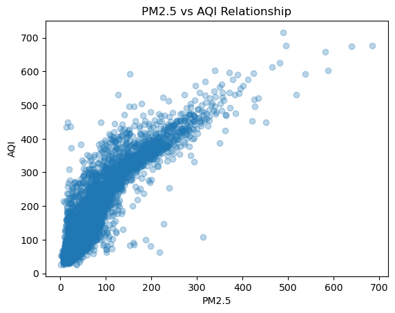
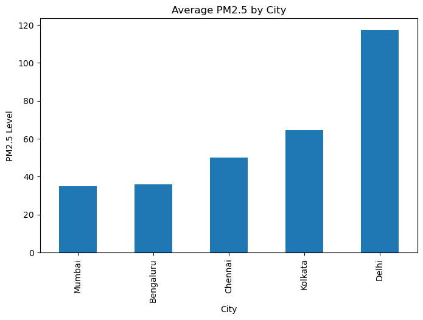
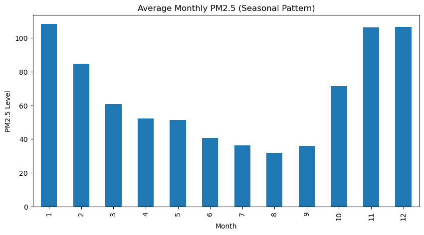

# 🌍 Air Quality Analysis & AQI Prediction

A data science project focused on analyzing air pollution trends across major Indian cities and understanding the impact of PM2.5 on Air Quality Index (AQI).
---
## 🚀 Project Overview

Air pollution is one of the most critical environmental issues in urban areas.
This project analyzes historical air quality data to:
- Understand pollution patterns across cities
- Identify trends over time
- Compare air quality levels
- Visualize PM2.5 and AQI relationships
---
## 📊 Dataset

- Source: `city_day.csv`
- Cities Used:
  - Delhi
  - Mumbai
  - Bengaluru
  - Kolkata
  - Chennai

### Features Used:
- Date
- City
- PM2.5
- AQI
---
## 🧠 Objectives

- Perform data cleaning and preprocessing
- Handle missing values
- Analyze pollution trends over time
- Compare AQI across cities
- Visualize insights using graphs
---
## ⚙️ Technologies Used

- Python
- Pandas
- NumPy
- Matplotlib
- Jupyter Notebook
---
## 📈 Key Analysis

### 1. Time Series Analysis
- AQI trends over months and years

### 2. City-wise Comparison
- Which city is most polluted?

### 3. PM2.5 vs AQI Relationship
- Strong correlation analysis
---
## 📊 Visualizations

- Line plots (AQI trends)
- Bar charts (city comparison)
- Scatter plots (PM2.5 vs AQI)
---
## 🔍 Key Insights

- Delhi consistently shows the highest AQI levels
- PM2.5 is a major contributor to AQI
- Pollution peaks during winter months
- Coastal cities like Chennai show relatively better air quality
---
# 🌍 Air Quality Analysis & AQI Prediction

A data science project analyzing air pollution trends across major Indian cities using real-world data.

---

## 🚀 Project Overview

Air pollution is one of the most critical environmental challenges in urban areas.

This project explores AQI and PM2.5 data to:
- Understand pollution patterns
- Compare air quality across cities
- Identify trends over time
- Visualize environmental insights

---

## 📊 Dataset

- Source: `city_day.csv`

### Cities Analyzed:
- Delhi
- Mumbai
- Bengaluru
- Kolkata
- Chennai

### Features Used:
- Date
- City
- PM2.5
- AQI

---

## ⚙️ Technologies Used

- Python
- Pandas
- NumPy
- Matplotlib
- Jupyter Notebook

---

## 📈 Key Analysis

### 🔹 Time-Series Trends
Analyzing how AQI changes over time

### 🔹 City-wise Comparison
Identifying the most polluted cities

### 🔹 PM2.5 vs AQI
Understanding correlation between PM2.5 and AQI

---

## 📊 Visualizations

### 📌 AQI vs PM2.5 Relationship

---

### 📌 Average AQI by City

---

### 📌 AQI Trend Over Time

---

## 🔍 Key Insights

- Delhi consistently records the highest AQI levels
- PM2.5 has a strong influence on AQI values
- Pollution peaks during winter months
- Coastal cities like Chennai show relatively better air quality

---
## ⚠️ Challenges Faced

- Handling missing PM2.5 values
- Cleaning inconsistent time-series data
- Selecting relevant features for analysis
---
## 🔮 Future Improvements

- Add Machine Learning for AQI prediction
- Include more pollutants (NO2, SO2)
- Build an interactive dashboard (Streamlit)
- Integrate real-time pollution data
---
## 📂 Project Structure
air-quality-analysis-india/
│
├── README.md
├── AQI_Data.ipynb
├── AQI_Data.html
├── city_day.csv
└── images/
├── aqi_relation.png
├── avg.png
├── d1.png
├── download.png

---
## 🧑‍💻 Author
**Vinit Raj**
---
## ⭐ If you found this useful, give it a star!
